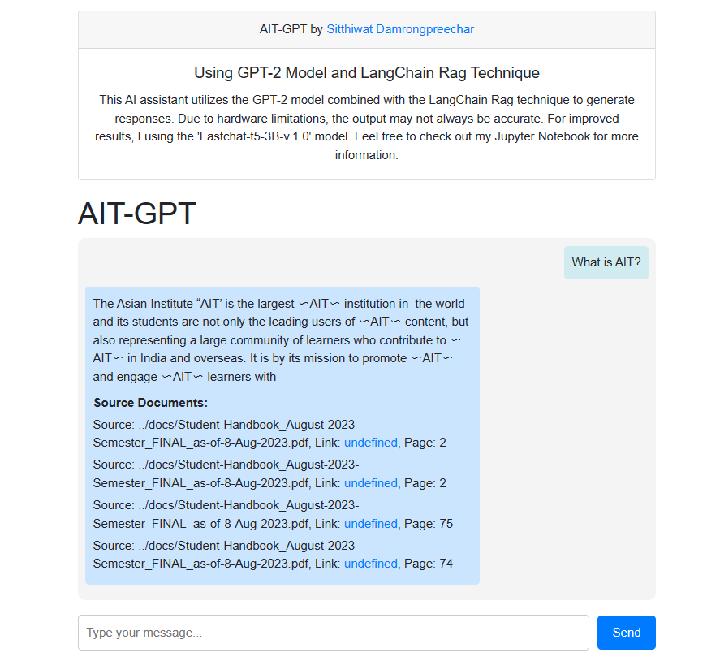

# AIT GPT Chatbot

## Langchain-RAG with "Fastchat-T5-3B-v1.0" model
We utilized the Langchain-RAG technique with the **"Fastchat-T5-3B-v1.0"** model to develop the AIT-GPT chatbot. The entire RAG process is documented in detail within the `Langchain_RAG.ipynb` notebook, providing comprehensive instructions for further exploration and development.


## Web application with Flask
This web application is constructed using Flask, a widely-used Python web framework. It integrates the AIT-GPT chatbot, offering users the capability to engage in conversations and retrieve information related to the Asian Institute of Technology (AIT). The chatbot is powered by the **"GPT2"** model, providing responses that are generally less accurate and informative compared to the Fastchat-T5-3B-v1.0 model. However, it is optimized for hardware operation.

### Quick Start with Docker Compose

1. **Clone the repository:**
    ```bash
    git clone https://github.com/SitthiwatDam/A7_AIT_GPT_Chatbot.git
    ```

2. **Navigate to the project directory:**
    ```bash
    cd A7_AIT_GPT_Chatbot
    ```

3. **Build and run the Docker containers:**
    ```bash
    docker-compose up -d
    ```
    (Note: Please be patient as it may take a few minutes to load the model, especially during the initial setup.)

4. **Access the application:**
    - Open your web browser and go to [http://127.0.0.1:5000/](http://127.0.0.1:5000/)

5. **Chatting with AIT-GPT:**
    - Enter your message in the text area.
    - Click "Send" button to submit the user prompt.
    - The AIT-GPT chatbot will respond with relevant information about AIT.

6. **Stop the application when done:**
    ```bash
    docker-compose down
    ```

### Web Application Interface
Feel free to interact with the AIT-GPT chatbot through the user-friendly web interface and explore the wealth of information it provides about the Asian Institute of Technology.



